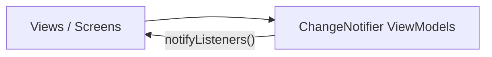
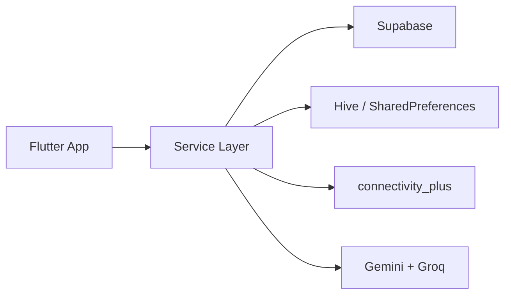
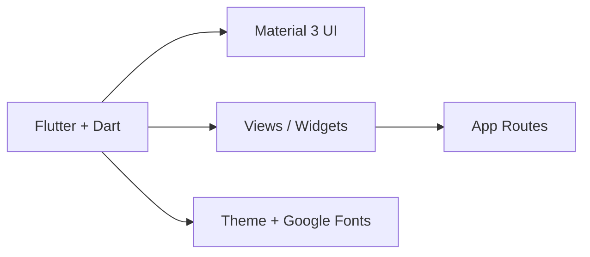

# GuideU Architecture Overview

## State Management

```mermaid
flowchart LR
  Views["Views / Screens"] --> VMs["ChangeNotifier ViewModels"]
  VMs -->|"notifyListeners()"| Views
```

## Backend Integration

```mermaid
flowchart LR
  App["Flutter App"] --> Services["Service Layer"]
  Services --> Supabase["Supabase"]
  Services --> Cache["Hive / SharedPreferences"]
  Services --> Net["connectivity_plus"]
  Services --> AI["Gemini + Groq"]
```

## Frontend Framework

```mermaid
flowchart LR
  Flutter["Flutter + Dart"] --> Material["Material 3 UI"]
  Flutter --> Pages["Views / Widgets"]
  Flutter --> Theme["Theme + Google Fonts"]
  Pages --> Routes["App Routes"]
```
