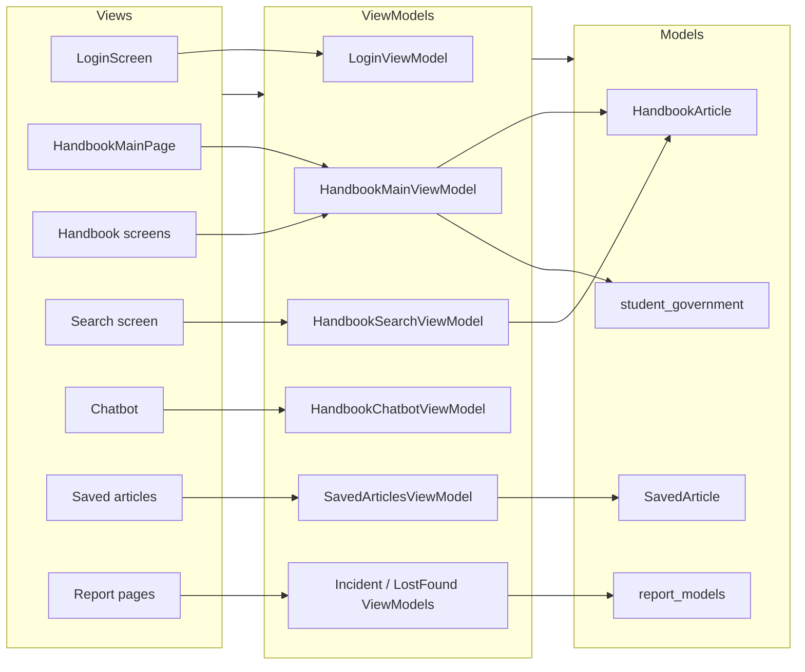

# GuideU Flutter MVVM Architecture

This is a simplified view of the Flutter app structure under `frontend/guide_u_flutter/lib`.

## Readout

- Views render the UI.
- ViewModels hold state and business logic.
- Models represent the data used by the app, including handbook content, saved items, reports, and student government data.
- Most of the app flows from Views to ViewModels, then down to Models and external services behind the scenes.
